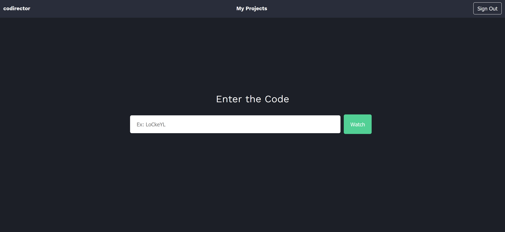
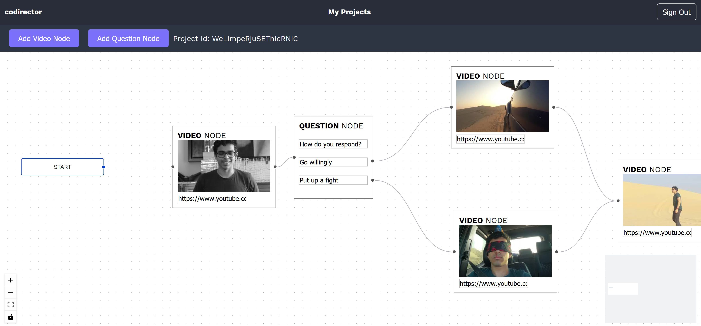
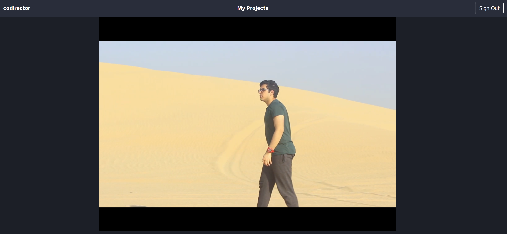
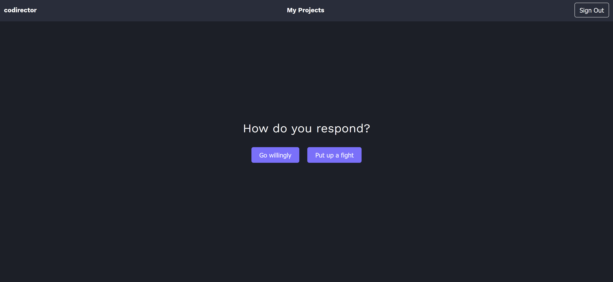

<h1 align="center">codirector</h1>

> Software to make and distribute interactive films

## Preview

### Landing Page


### Create a Film


### Watching a Film


### Making a Choice



## Install

```sh
npm install
```

## Usage

In order to use codirector, you will need to link it to a GCP Firebase Real-Time Database. 

```sh
npm start
```